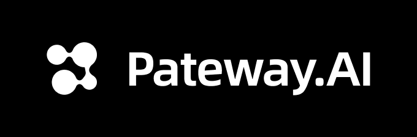

<div align="center">


# Sub2API

[](https://golang.org/)
[](https://vuejs.org/)
[](https://www.postgresql.org/)
[](https://redis.io/)
[](https://www.docker.com/)

<a href="https://trendshift.io/repositories/21823" target="_blank"></a>

**サブスクリプションクォータ配分のための AI API ゲートウェイプラットフォーム**

[English](README.md) | [中文](README_CN.md) | 日本語

</div>

## ⚠️ 重要なお知らせ

本プロジェクトをご利用になる前に、以下の内容を必ずよくお読みください：

- **🚨 利用規約のリスク**：本プロジェクトの使用は、Anthropic をはじめとする上流プロバイダーの利用規約に違反する可能性があります。ご利用前に各プロバイダーのユーザー規約を必ずご確認ください。使用により生じるすべてのリスクはユーザーご自身が負うものとします。
- **⚖️ 法令遵守**：お住まいの国または地域の法令を遵守した上で本プロジェクトをご利用ください。いかなる違法な目的での使用も固く禁じます。
- **📖 免責事項**：本プロジェクトは技術的な学習および研究の目的でのみ提供されます。本プロジェクトの使用により生じたアカウントの停止、サービスの中断、データの損失、その他一切の直接的または間接的な損害について、作者は一切の責任を負いません。

## 概要

Sub2API は、AI 製品のサブスクリプションから API クォータを配分・管理するために設計された AI API ゲートウェイプラットフォームです。ユーザーはプラットフォームが生成した API キーを通じて上流の AI サービスにアクセスでき、プラットフォームは認証、課金、負荷分散、リクエスト転送を処理します。

## 機能

- **マルチアカウント管理** - 複数の上流アカウントタイプ（OAuth、APIキー）をサポート
- **APIキー配布** - ユーザー向けの APIキーの生成と管理
- **精密な課金** - トークンレベルの使用量追跡とコスト計算
- **スマートスケジューリング** - スティッキーセッション付きのインテリジェントなアカウント選択
- **同時実行制御** - ユーザーごと・アカウントごとの同時実行数制限
- **レート制限** - 設定可能なリクエスト数およびトークンレート制限
- **内蔵決済システム** - EasyPay、Alipay、WeChat Pay、Stripe に対応。ユーザーのセルフサービスチャージが可能で、別途決済サービスのデプロイは不要（[設定ガイド](docs/PAYMENT.md)）
- **管理ダッシュボード** - 監視・管理のための Web インターフェース
- **外部システム連携** - 外部システム（チケット管理など）を iframe 経由で管理ダッシュボードに埋め込み可能

## ❤️ スポンサー

> [こちらに掲載しませんか？](mailto:support@pincc.ai)

<table>

<tr>
<td width="180"><a href="https://www.openmodel.ai?ref=sub2api"></a></td>
<td>1つの API で、トップモデルを使い放題！<a href="https://www.openmodel.ai?ref=sub2api">OpenModel</a> は本番環境グレードで高可用性の AI API ゲートウェイに特化し、アプリを真に高速・安定させます：自動フェイルオーバー、最適なチャネルへのスマートルーティング、本番グレードの SLA 保証。単一プロバイダーをはるかに上回る SLA で、安定性をあなたの核心的な競争力にします。</td>
</tr>

<tr>
<td width="180"><a href="https://poixe.com/i/sub2api"></a></td>
<td>Poixe AI のご支援に感謝します！Poixe AI は信頼性の高い LLM API サービスを提供しています。プラットフォームの API エンドポイントを活用して、AI 搭載プロダクトをシームレスに構築できます。また、ベンダーとして AI API リソースをプラットフォームに提供し、収益を得ることも可能です。専用の <a href="https://poixe.com/i/sub2api">sub2api</a> 紹介リンクから登録すると、初回チャージ時に $5 USD のボーナスがもらえます。</td>
</tr>

<tr>
<td width="180"><a href="https://ctok.ai"></a></td>
<td>CTok.ai のご支援に感謝します！CTok.ai はワンストップ AI プログラミングツールサービスプラットフォームの構築に取り組んでいます。Claude Code の専用プランと技術コミュニティサービスを提供し、Google Gemini や OpenAI Codex もサポートしています。丁寧に設計されたプランと専門的な技術コミュニティを通じて、開発者に安定したサービス保証と継続的な技術サポートを提供し、AI アシスト プログラミングを真の生産性向上ツールにします。<a href="https://ctok.ai">こちら</a>から登録！</td>
</tr>

<tr>
<td width="180"><a href="https://code.silkapi.com/"></a></td>
<td>SilkAPI のご支援に感謝します！<a href="https://code.silkapi.com/">SilkAPI</a> は Sub2API をベースに構築された中継サービスで、高速かつ安定した Codex API 中継の提供に特化しています。</td>
</tr>

<tr>
<td width="180"><a href="https://ylscode.com/"></a></td>
<td>YLS Code のご支援に感謝します！<a href="https://ylscode.com/">YLS Code</a> は安全なエンタープライズグレードの Coding Agent 生産性サービスの構築に取り組んでおり、安定かつ高速な Codex / Claude / Gemini サブスクリプションサービスと従量課金 API の柔軟なプランを提供しています。期間限定で新規登録者に 3 日間の Codex 試用特典をプレゼント中！</td>
</tr>

<tr>
<td width="180"><a href="https://aigocode.com/invite/SUB2API"></a></td>
<td>AIGoCode のご支援に感謝します！AIGoCode は Claude Code、Codex、最新の Gemini モデルを統合したオールインワンプラットフォームで、安定的かつ効率的でコストパフォーマンスに優れた AI コーディングサービスを提供します。柔軟なサブスクリプションプラン、アカウント停止リスクゼロ、VPN 不要の直接アクセス、超高速レスポンスが特長です。AIGoCode は sub2api ユーザー向けに特別特典を用意しています：<a href="https://aigocode.com/invite/SUB2API">こちらのリンク</a>から登録すると、初回チャージ時に 10% のボーナスクレジットを追加プレゼント！</td>
</tr>

<tr>
<td width="180"><a href="https://codex-everywhere.com"></a></td>
<td>OpenAI 公式価格のわずか 3% で本物の GPT-5.6 シリーズを提供 — <a href="https://codex-everywhere.com">CodexEverywhere</a> は世界中の開発者にフロンティアモデルへのアクセスを民主化しています。私たちは透明性と誠実さを信条とし、モデル品質は数か月にわたるアクティブなコミュニティの監視によって検証されています。USD および暗号通貨に対応。<a href="https://codex-everywhere.com">codex-everywhere.com</a> で $20 の無料トライアルから始めましょう。</td>
</tr>

<tr>
<td width="180"><a href="https://shop.bmoplus.com/?utm_source=github"></a></td>
<td>本プロジェクトにご支援いただいた BmoPlus に感謝いたします！BmoPlusは、AIサブスクリプションのヘビーユーザー向けに特化した信頼性の高いAIアカウントサービスプロバイダーであり、安定した ChatGPT Plus / ChatGPT Pro (完全保証) / Claude Pro / Super Grok / Gemini Pro の公式代行チャージおよび即納アカウントを提供しています。こちらの<a href="https://shop.bmoplus.com/?utm_source=github">BmoPlus AIアカウント専門店/代行チャージ</a>経由でご登録・ご注文いただいたユーザー様は、GPTを 公式サイト価格の約1割（90% OFF） という驚異的な価格でご利用いただけます！</td>
</tr>

<tr>
<td width="180"><a href="https://bestproxy.com/?keyword=a2e8iuol"></a></td>
<td>Bestproxy のご支援に感謝します！<a href="https://bestproxy.com/?keyword=a2e8iuol">Bestproxy</a> は高純度の住宅IPを提供し、1アカウント1IP専有をサポートしています。実際の家庭ネットワークとフィンガープリント分離を組み合わせることで、リンク環境の分離を実現し、関連付けによるリスク管理の確率を低減します。</td>
</tr>

<tr>
<td width="180"><a href="https://pateway.ai/?ch=1tsfr51"></a></td>
<td>PatewayAI のご支援に感謝します！PatewayAI は、ヘビーAI開発者向けに公式直結を重視した高品質モデルAPIリレーサービスプロバイダーです。Claude 全シリーズおよび Codex シリーズモデルを提供し、100%公式ソースから直接供給 — 偽りなし、水増しなし、検証歓迎。課金は完全透明で、トークン単位の請求書を1件ずつ監査可能です。
エンタープライズ級の高同時接続にも対応し、法人顧客向けに専用管理プラットフォームを提供しています。法人顧客は正式な契約を締結し、請求書の発行が可能です。詳細は公式サイトでお問い合わせください。
<a href="https://pateway.ai/?ch=1tsfr51">こちらのリンク</a>から登録すると、$3 のトライアルクレジットがもらえます。チャージは最大40%オフ、友達紹介で双方にボーナス付与 — 紹介報酬は最大 $150。</td>
</tr>

</table>

## エコシステム

Sub2API を拡張・統合するコミュニティプロジェクト:

| プロジェクト | 説明 | 機能 |
|---------|-------------|----------|
| ~~[Sub2ApiPay](https://github.com/touwaeriol/sub2apipay)~~ | ~~セルフサービス決済システム~~ | **内蔵済み** — 決済機能は Sub2API に統合されました。別途デプロイは不要です。[決済設定ガイド](docs/PAYMENT.md)をご参照ください |
| [sub2api-mobile](https://github.com/ckken/sub2api-mobile) | モバイル管理コンソール | ユーザー管理、アカウント管理、監視ダッシュボード、マルチバックエンド切り替えが可能なクロスプラットフォームアプリ（iOS/Android/Web）。Expo + React Native で構築 |

## 技術スタック

| コンポーネント | 技術 |
|-----------|------------|
| バックエンド | Go 1.26.6, Gin, Ent |
| フロントエンド | Vue 3.4+, Vite 5+, TailwindCSS |
| データベース | PostgreSQL 15+ |
| キャッシュ/キュー | Redis 7+ |

---

## Nginx リバースプロキシに関する注意

Sub2API（または CRS）を Nginx でリバースプロキシし、Codex CLI と組み合わせて使用する場合、Nginx の `http` ブロックに以下の設定を追加してください:

```nginx
underscores_in_headers on;
```

Nginx はデフォルトでアンダースコアを含むヘッダー（例: `session_id`）を破棄するため、マルチアカウント構成でのスティッキーセッションルーティングに支障をきたします。

---

## デプロイ

### 方法1: スクリプトによるインストール（推奨）

GitHub Releases からビルド済みバイナリをダウンロードするワンクリックインストールスクリプトです。

#### 前提条件

- Linux サーバー（amd64 または arm64）
- PostgreSQL 15+（インストール済みかつ稼働中）
- Redis 7+（インストール済みかつ稼働中）
- root 権限

#### インストール手順

```bash
curl -sSL https://raw.githubusercontent.com/Wei-Shaw/sub2api/main/deploy/install.sh | sudo bash
```

スクリプトは以下を実行します:
1. システムアーキテクチャの検出
2. 最新リリースのダウンロード
3. バイナリを `/opt/sub2api` にインストール
4. systemd サービスの作成
5. システムユーザーと権限の設定

#### インストール後の作業

```bash
# 1. サービスを起動
sudo systemctl start sub2api

# 2. 起動時の自動起動を有効化
sudo systemctl enable sub2api

# 3. ブラウザでセットアップウィザードを開く
# http://YOUR_SERVER_IP:8080
```

セットアップウィザードでは以下の設定を行います:
- データベース設定
- Redis 設定
- 管理者アカウントの作成

#### アップグレード

**管理ダッシュボード**の左上にある**アップデートを確認**ボタンをクリックすることで、ダッシュボードから直接アップグレードできます。

Web インターフェースでは以下が可能です:
- 新しいバージョンの自動確認
- ワンクリックでのアップデートのダウンロードと適用
- 必要に応じたロールバック

#### よく使うコマンド

```bash
# ステータスを確認
sudo systemctl status sub2api

# ログを表示
sudo journalctl -u sub2api -f

# サービスを再起動
sudo systemctl restart sub2api

# アンインストール
curl -sSL https://raw.githubusercontent.com/Wei-Shaw/sub2api/main/deploy/install.sh | sudo bash -s -- uninstall -y
```

---

### 方法2: Docker Compose（推奨）

PostgreSQL と Redis のコンテナを含む Docker Compose でデプロイします。

#### 前提条件

- Docker 20.10+
- Docker Compose v2+

#### クイックスタート（ワンクリックデプロイ）

自動デプロイスクリプトを使用して簡単にセットアップできます:

```bash
# デプロイ用ディレクトリを作成
mkdir -p sub2api-deploy && cd sub2api-deploy

# デプロイ準備スクリプトをダウンロードして実行
curl -sSL https://raw.githubusercontent.com/Wei-Shaw/sub2api/main/deploy/docker-deploy.sh | bash

# サービスを起動
docker compose up -d

# ログを表示
docker compose logs -f sub2api
```

**スクリプトの動作内容:**
- `docker-compose.local.yml`（`docker-compose.yml` として保存）と `.env.example` をダウンロード
- セキュアな認証情報（JWT_SECRET、TOTP_ENCRYPTION_KEY、POSTGRES_PASSWORD）を自動生成
- 自動生成されたシークレットで `.env` ファイルを作成
- データディレクトリを作成（バックアップ・移行が容易なローカルディレクトリを使用）
- 生成された認証情報を参照用に表示

#### 手動デプロイ

手動でセットアップする場合:

```bash
# 1. リポジトリをクローン
git clone https://github.com/Wei-Shaw/sub2api.git
cd sub2api/deploy

# 2. 環境設定ファイルをコピー
cp .env.example .env
chmod 600 .env

# 3. 設定を編集（セキュアなパスワードを生成）
nano .env
```

**`.env` の必須設定:**

```bash
# PostgreSQL パスワード（必須）
POSTGRES_PASSWORD=your_secure_password_here

# JWT シークレット（推奨 - 再起動後もユーザーのログイン状態を保持）
JWT_SECRET=your_jwt_secret_here

# TOTP 暗号化キー（推奨 - 再起動後も二要素認証を維持）
TOTP_ENCRYPTION_KEY=your_totp_key_here

# オプション: 管理者アカウント
ADMIN_EMAIL=admin@example.com
ADMIN_PASSWORD=your_admin_password

# オプション: カスタムポート
SERVER_PORT=8080
```

**セキュアなシークレットの生成方法:**
```bash
# JWT_SECRET を生成
openssl rand -hex 32

# TOTP_ENCRYPTION_KEY を生成
openssl rand -hex 32

# POSTGRES_PASSWORD を生成
openssl rand -hex 32
```

```bash
# 4. データディレクトリを作成（ローカルバージョンの場合）
mkdir -p data postgres_data redis_data

# 5. すべてのサービスを起動
# オプション A: ローカルディレクトリバージョン（推奨 - 移行が容易）
docker compose -f docker-compose.local.yml up -d

# オプション B: 名前付きボリュームバージョン（シンプルなセットアップ）
docker compose up -d

# 6. ステータスを確認
docker compose -f docker-compose.local.yml ps

# 7. ログを表示
docker compose -f docker-compose.local.yml logs -f sub2api
```

#### デプロイバージョン

| バージョン | データストレージ | 移行 | 推奨用途 |
|---------|-------------|-----------|----------|
| **docker-compose.local.yml** | ローカルディレクトリ | ✅ 容易（ディレクトリ全体を tar） | 本番環境、頻繁なバックアップ |
| **docker-compose.yml** | 名前付きボリューム | ⚠️ docker コマンドが必要 | シンプルなセットアップ |

**推奨:** データ管理が容易な `docker-compose.local.yml`（スクリプトによるデプロイ）を使用してください。

#### アクセス

ブラウザで `http://YOUR_SERVER_IP:8080` を開いてください。

管理者パスワードが自動生成された場合は、ログで確認できます:
```bash
docker compose -f docker-compose.local.yml logs sub2api | grep "admin password"
```

#### アップグレード

```bash
# 最新イメージをプルしてコンテナを再作成
docker compose -f docker-compose.local.yml pull
docker compose -f docker-compose.local.yml up -d
```

#### 簡単な移行（ローカルディレクトリバージョン）

`docker-compose.local.yml` を使用している場合、新しいサーバーへの移行が簡単です:

```bash
# 移行元サーバーにて
docker compose -f docker-compose.local.yml down
cd ..
tar czf sub2api-complete.tar.gz sub2api-deploy/

# 新しいサーバーに転送
scp sub2api-complete.tar.gz user@new-server:/path/

# 移行先サーバーにて
tar xzf sub2api-complete.tar.gz
cd sub2api-deploy/
docker compose -f docker-compose.local.yml up -d
```

#### よく使うコマンド

```bash
# すべてのサービスを停止
docker compose -f docker-compose.local.yml down

# 再起動
docker compose -f docker-compose.local.yml restart

# すべてのログを表示
docker compose -f docker-compose.local.yml logs -f

# すべてのデータを削除（注意！）
docker compose -f docker-compose.local.yml down
rm -rf data/ postgres_data/ redis_data/
```

---

### 方法3: Apple container（macOS）

Apple シリコン搭載 Mac と macOS 26 では、Apple `container` 1.1.0 以降を使用して Sub2API、PostgreSQL、Redis の完全なスタックを実行できます:

```bash
git clone https://github.com/Wei-Shaw/sub2api.git
cd sub2api/deploy
./apple-container.sh init
./apple-container.sh up
./apple-container.sh status
```

これはオペレーター管理のローカル運用フローです。本番環境では引き続き Docker Compose を推奨します。ライフサイクルコマンド、永続化、アップグレード、実行時の制約については [deploy/APPLE_CONTAINER.md](deploy/APPLE_CONTAINER.md) を参照してください。

---

### 方法4: ソースからビルド

開発やカスタマイズのためにソースコードからビルドして実行します。

#### 前提条件

- Go 1.21+
- Node.js 18+
- PostgreSQL 15+
- Redis 7+

#### ビルド手順

```bash
# 1. リポジトリをクローン
git clone https://github.com/Wei-Shaw/sub2api.git
cd sub2api

# 2. pnpm をインストール（未インストールの場合）
npm install -g pnpm

# 3. フロントエンドをビルド
cd frontend
pnpm install
pnpm run build
# 出力先: ../backend/internal/web/dist/

# 4. フロントエンドを組み込んだバックエンドをビルド
cd ../backend
VERSION="$(./scripts/resolve-version.sh)"
go build -tags embed -ldflags="-X main.Version=${VERSION}" -o sub2api ./cmd/server

# 5. 設定ファイルを作成
cp ../deploy/config.example.yaml ./config.yaml

# 6. 設定を編集
nano config.yaml
```

> **注意:** `-tags embed` フラグはフロントエンドをバイナリに組み込みます。このフラグがない場合、バイナリはフロントエンド UI を提供しません。

**`config.yaml` の主要設定:**

```yaml
server:
  host: "0.0.0.0"
  port: 8080
  mode: "release"

database:
  host: "localhost"
  port: 5432
  user: "postgres"
  password: "your_password"
  dbname: "sub2api"

redis:
  host: "localhost"
  port: 6379
  password: ""

jwt:
  secret: "change-this-to-a-secure-random-string"
  expire_hour: 24

default:
  user_concurrency: 5
  user_balance: 0
  api_key_prefix: "sk-"
  rate_multiplier: 1.0
```

**初回管理者の作成:** `config.yaml` が存在すると Web セットアップウィザードはスキップされ、`default.admin_email` / `default.admin_password` から管理者が作成されることもありません。新規のソースインストールでは「設定の作成/編集」を省略して `./sub2api` を起動し、`http://<host>:8080` で設定と管理者を作成するか、`./sub2api -setup` / `AUTO_SETUP` で初期化してください。設定を手動で事前作成するのは、対象データベースに管理者が既に存在する場合に限ります。

`config.yaml` では追加のセキュリティ関連オプションも利用できます:

- `cors.allowed_origins` - CORS 許可リスト
- `security.url_allowlist` - 上流/価格/CRS ホストの許可リスト
- `security.url_allowlist.enabled` - URL バリデーションの無効化（注意して使用）
- `security.url_allowlist.allow_insecure_http` - バリデーション無効時に HTTP URL を許可
- `security.url_allowlist.allow_private_hosts` - プライベート/ローカル IP アドレスを許可
- `security.response_headers.enabled` - 設定可能なレスポンスヘッダーフィルタリングを有効化（無効時はデフォルトの許可リストを使用）
- `security.csp` - Content-Security-Policy ヘッダーの制御
- `billing.circuit_breaker` - 課金エラー時にフェイルクローズ
- `server.trusted_proxies` - Gin が信頼する直結リバースプロキシの IP/CIDR を指定（空ならプロキシを信頼しない）
- `security.trust_forwarded_ip_for_api_key_acl` - API キーの IP 許可/拒否リストを Gin の信頼済みプロキシチェーンではなく、従来の生転送ヘッダー抽出へ切り替える（デフォルト `false`）
- `turnstile.required` - リリースモードでの Turnstile 必須化

API キー ACL はデフォルトで Gin の信頼済みプロキシチェーンを使用します。従来の上書きは無効のままにし、Sub2API に直接接続するリバースプロキシだけを `server.trusted_proxies` に設定してください。互換性のため生の `CF-Connecting-IP`、`X-Real-IP`、`X-Forwarded-For` 抽出を有効にする場合は、オリジンをプロキシ/CDN からの接続に制限し、エッジでこれらのヘッダーを必ず上書きしてください。

**⚠️ セキュリティ警告: HTTP URL 設定**

`security.url_allowlist.enabled=false` の場合、現在のデフォルトは最小限の URL バリデーションのみを行い、**HTTP URL を許可**します。ローカルまたは信頼できる内部ネットワークでは便利ですが、本番環境では HTTPS のみに明示的に制限してください:

```yaml
security:
  url_allowlist:
    enabled: false                # 許可リストチェックを無効化
    allow_insecure_http: false    # HTTPS のみ（本番環境推奨）
```

**または環境変数で設定:**

```bash
SECURITY_URL_ALLOWLIST_ENABLED=false
SECURITY_URL_ALLOWLIST_ALLOW_INSECURE_HTTP=false
```

**HTTP を許可するリスク:**
- API キーとデータが**平文**で送信される（傍受の危険性）
- **中間者攻撃（MITM）**を受けやすい
- **本番環境には不適切**

**HTTP を使用すべき場面:**
- ✅ ローカルサーバーでの開発・テスト（http://localhost）
- ✅ 信頼できるエンドポイントを持つ内部ネットワーク
- ✅ HTTPS 取得前のアカウント接続テスト
- ❌ 本番環境（HTTPS のみを使用）

**`allow_insecure_http: false` のとき HTTP URL に対して返るエラー例:**
```
Invalid base URL: invalid url scheme: http
```

URL バリデーションまたはレスポンスヘッダーフィルタリングを無効にする場合は、ネットワーク層を強化してください:
- 上流ドメイン/IP のエグレス許可リストを適用
- プライベート/ループバック/リンクローカル範囲をブロック
- TLS のみのアウトバウンドトラフィックを強制
- プロキシで機密性の高い上流レスポンスヘッダーを除去

#### OpenAI Responses WebSocket モードと HTTP bridge

Codex 形式の Responses WebSocket 入口では、アカウントごとに `off`、`ctx_pool`、`passthrough`、`http_bridge` を選択できます。アカウント画面でこれらを選ぶ前に v2 モードルーターを有効にしてください:

```yaml
gateway:
  openai_ws:
    mode_router_v2_enabled: true
    ingress_mode_default: ctx_pool
    http_bridge_enabled: true
    http_bridge_threshold_bytes: 15728640 # 15 MiB
```

`off` は HTTP/SSE にフォールバックし、`ctx_pool` は管理された上流 WebSocket プールを使用し、`passthrough` は上流 WebSocket アダプター経由でクライアントセッションを転送します。`http_bridge` はクライアント側 WebSocket を維持しながら、上流 turn を HTTP/SSE で実行します。bridge が有効なら、しきい値を超える大きなフレームは自動的に切り替えられます。Grok の WebSocket 入口は xAI の HTTP/SSE Responses 上流へ接続するため HTTP bridge を使用します。緊急時の全体ロールバックには `gateway.openai_ws.force_http=true` を設定します。

```bash
# 7. アプリケーションを実行
./sub2api
```

#### HTTP/2（h2c）と HTTP/1.1 フォールバック

メインの平文リスナーは `server.h2c.enabled=true` のとき h2c を有効にします（`deploy/config.example.yaml` では有効）。WebSocket アップグレードと旧クライアント向けに HTTP/1.1 も引き続き利用できます:

```yaml
server:
  h2c:
    enabled: true
```

Caddy との間では `versions h2c h1` で両方を指定します。`curl --http2-prior-knowledge -I http://localhost:8080/health` と `curl --http1.1 -I http://localhost:8080/health` でバックエンドを確認できます。

#### 開発モード

```bash
# バックエンド（ホットリロード付き）
cd backend
go run ./cmd/server

# フロントエンド（ホットリロード付き）
cd frontend
pnpm run dev
```

#### コード生成

`backend/ent/schema` を編集した場合、Ent + Wire を再生成してください:

```bash
cd backend
go generate ./ent
go generate ./cmd/server
```

---

## シンプルモード

シンプルモードは、フル SaaS 機能を必要とせず、素早くアクセスしたい個人開発者や社内チーム向けに設計されています。

- 有効化: 環境変数 `RUN_MODE=simple` を設定
- 違い: SaaS 関連機能を非表示にし、課金プロセスをスキップ
- セキュリティに関する注意: 本番環境では `SIMPLE_MODE_CONFIRM=true` も設定する必要があります

---

## Grok / xAI サポート

Sub2API は、xAI OAuth を使用する Grok サブスクリプションアカウントと標準の xAI API キーアカウントの両方をサポートし、アカウント種別に応じた xAI 上流へ転送します。

### 対応範囲

- プラットフォーム名: `grok`。アカウント種別: OAuth サブスクリプション、xAI API キー
- Responses: `/v1/responses`、`/responses`、`/backend-api/codex/responses`
- Claude 互換: `/v1/messages`（xAI Responses に変換し、Anthropic Messages 形式で返却）
- Chat Completions: `/v1/chat/completions`、`/chat/completions`
- Codex 形式の Responses WebSocket 入口は HTTP bridge で xAI の HTTP/SSE 上流へ接続
- テキストモデル: `grok-4.5`、`grok-4.3`、`grok-build-0.1`、`grok-composer-2.5-fast`、Grok 4.20 reasoning/non-reasoning/multi-agent 系列
- Grok グループでは画像の生成/編集と動画の生成/編集/拡張/状態照会をサポート。生成、編集、拡張にはグループの画像生成権限が必要
- メディアモデル: `grok-imagine`、`grok-imagine-image-quality`、`grok-imagine-image`、`grok-imagine-image-2.0`、`grok-imagine-edit`、`grok-imagine-video`、`grok-imagine-video-1.5`
- JSON の画像編集・動画生成では `image`、`images`、`reference_images`、`mask` に画像参照を指定可能。xAI 互換の `url` を推奨し、従来の `image_url` は転送前に正規化

### OAuth と API キー設定

OAuth は PKCE を使用し、非公開クライアントシークレットをコミットする必要はありません。主な環境変数:

| 変数 | デフォルト |
|------|----------|
| `XAI_OAUTH_SCOPE` | `openid profile email offline_access grok-cli:access api:access` |
| `XAI_OAUTH_REDIRECT_URI` | `http://127.0.0.1:56121/callback` |
| `XAI_BASE_URL` | `https://api.x.ai/v1`（実際の転送先はアカウントの `base_url`） |
| `XAI_GROK_CLI_VERSION` | `0.2.114`。この下限未満の上書き値は無視 |

管理画面では Grok OAuth アカウントの作成・再認証と Grok API キーアカウントの作成ができます。OAuth は既定で `https://cli-chat-proxy.grok.com/v1` を推定し、API キーアカウントは公式の `https://api.x.ai/v1` と既存の `base_url` / `api_key` フィールドを使用します。

### Grok Build CLI 設定

Grok アカウントを Grok グループへ追加し、そのグループ用の Sub2API API キーを作成した後、ユーザー API キー画面の **Use Key → Grok CLI** から設定を生成できます。手動設定は `~/.grok/config.toml`（Windows: `%USERPROFILE%\.grok\config.toml`）に保存します:

```toml
[models]
default = "grok"
web_search = "grok"

[model."grok"]
model = "grok-4.5"
base_url = "https://your-sub2api.example.com/v1"
name = "Grok 4.5"
api_key = "sk-your-sub2api-key"
api_backend = "responses"
context_window = 1000000
supports_backend_search = true
```

設定ファイルには API キーが含まれるため権限を制限し、`grok inspect` で確認してください。`base_url` は `/v1` で終わる公開 Sub2API URL であり、xAI の内部上流 URL ではありません。

### 使用量、クォータ、メディア適格性

xAI クォータは受動的に観測します。上流が信頼済み rate-limit ヘッダーを実際に返した場合のみ記録し、最初の有効な観測まではクォータを不明と表示しつつ Sub2API のローカル使用量を表示します。`401`、`403`、`429` はそれぞれ無効な資格情報、アクセス/権限エラー、一時的なレート制限として処理されます。

新しい画像・動画生成にはメディア専用の適格性チェックも適用されます。API キーアカウントはデフォルトで適格ですが、OAuth アカウントには xAI 課金プローブによる有料権限の肯定的な証拠が必要です。Free、禁止、欠落、不正形式、不確定な観測は新規メディア生成から除外され、適格なアカウントがなければ HTTP `503` と `grok_media_no_eligible_account` を返します。管理者はアカウントフィールド `extra.grok_media_eligible` で自動判定を上書きできます。

---

## Antigravity サポート

Sub2API は [Antigravity](https://antigravity.so/) アカウントをサポートしています。認証後、Claude および Gemini モデル用の専用エンドポイントが利用可能になります。

### 専用エンドポイント

| エンドポイント | モデル |
|----------|-------|
| `/antigravity/v1/messages` | Claude モデル |
| `/antigravity/v1beta/` | Gemini モデル |

### Claude Code の設定

```bash
export ANTHROPIC_BASE_URL="http://localhost:8080/antigravity"
export ANTHROPIC_AUTH_TOKEN="sk-xxx"
```

### ハイブリッドスケジューリングモード

Antigravity アカウントはオプションの**ハイブリッドスケジューリング**をサポートしています。有効にすると、汎用エンドポイント `/v1/messages` および `/v1beta/` も Antigravity アカウントにリクエストをルーティングします。

> **⚠️ 警告**: Anthropic Claude と Antigravity Claude は**同じ会話コンテキスト内で混在させることはできません**。グループを使用して適切に分離してください。

### 既知の問題

Claude Code では、Plan Mode を自動的に終了できません。（通常、ネイティブの Claude API を使用する場合、計画が完了すると Claude Code はユーザーに計画を承認または拒否するオプションをポップアップ表示します。）

**回避策**: `Shift + Tab` を押して手動で Plan Mode を終了し、計画を承認または拒否するためのレスポンスを入力してください。

---

## プロジェクト構成

```
sub2api/
├── backend/                  # Go バックエンドサービス
│   ├── cmd/server/           # アプリケーションエントリ
│   ├── internal/             # 内部モジュール
│   │   ├── config/           # 設定
│   │   ├── model/            # データモデル
│   │   ├── service/          # ビジネスロジック
│   │   ├── handler/          # HTTP ハンドラー
│   │   └── gateway/          # API ゲートウェイコア
│   └── resources/            # 静的リソース
│
├── frontend/                 # Vue 3 フロントエンド
│   └── src/
│       ├── api/              # API 呼び出し
│       ├── stores/           # 状態管理
│       ├── views/            # ページコンポーネント
│       └── components/       # 再利用可能なコンポーネント
│
└── deploy/                   # デプロイファイル
    ├── docker-compose.yml    # Docker Compose 設定
    ├── .env.example          # Docker Compose 用環境変数
    ├── config.example.yaml   # バイナリデプロイ用フル設定ファイル
    └── install.sh            # ワンクリックインストールスクリプト
```

## 免責事項

> **本プロジェクトをご利用の前に、以下をよくお読みください:**
>
> :rotating_light: **利用規約違反のリスク**: 本プロジェクトの使用は Anthropic の利用規約に違反する可能性があります。使用前に Anthropic のユーザー契約をよくお読みください。本プロジェクトの使用に起因するすべてのリスクは、ユーザー自身が負うものとします。
>
> :book: **免責事項**: 本プロジェクトは技術的な学習および研究目的のみで提供されています。作者は、本プロジェクトの使用によるアカウント停止、サービス中断、その他の損失について一切の責任を負いません。

---

## スター履歴

<a href="https://star-history.dera.page/#Wei-Shaw/sub2api&Date">
 <picture>
   <source media="(prefers-color-scheme: dark)" srcset="https://star-history.dera.page/svg?repos=Wei-Shaw/sub2api&type=Date&theme=dark" />
   <source media="(prefers-color-scheme: light)" srcset="https://star-history.dera.page/svg?repos=Wei-Shaw/sub2api&type=Date" />
   
 </picture>
</a>

---

## ライセンス

本プロジェクトは [GNU Lesser General Public License v3.0](LICENSE)（またはそれ以降のバージョン）の下でライセンスされています。

Copyright (c) 2026 Wesley Liddick

---

<div align="center">

**このプロジェクトが役に立ったら、ぜひスターをお願いします！**

</div>
